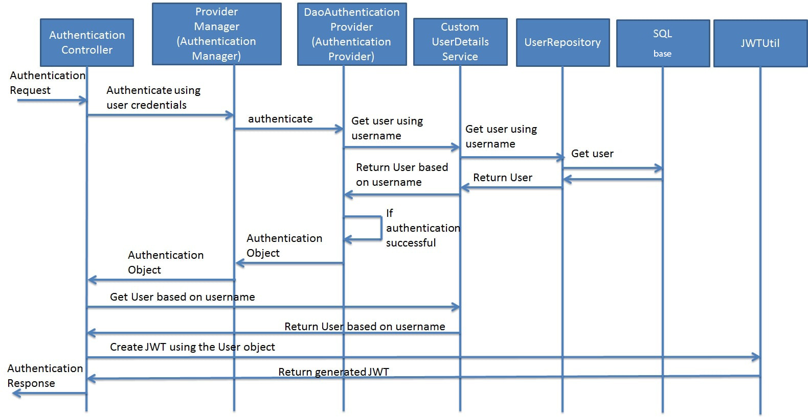

        curl 'http://localhost:8080/register' -i -X POST -H 'Content-Type: application/json;charset=UTF-8' -d '{"username" : "admin", "password" : "admin", "role" : "ROLE_ADMIN"}'
        curl 'http://localhost:8080/register' -i -X POST -H 'Content-Type: application/json;charset=UTF-8' -d '{"username" : "user", "password" : "user", "role" : "ROLE_USER"}'
        
        curl 'http://localhost:8080/authenticate' -i -X POST -H 'Content-Type: application/json;charset=UTF-8' -d '{"username" : "admin", "password" : "admin"}'
        curl 'http://localhost:8080/authenticate' -i -X POST -H 'Content-Type: application/json;charset=UTF-8' -d '{"username" : "user", "password" : "user"}'